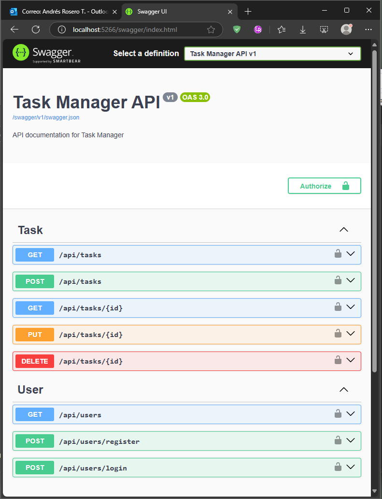
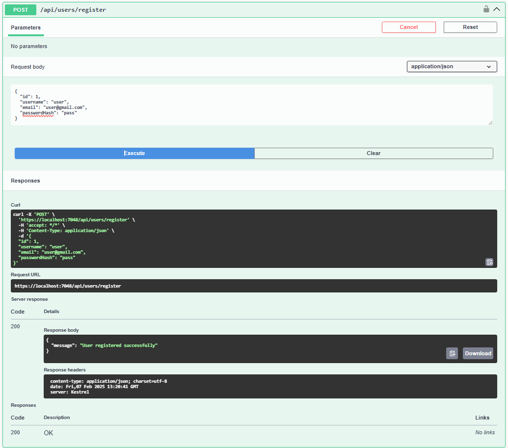
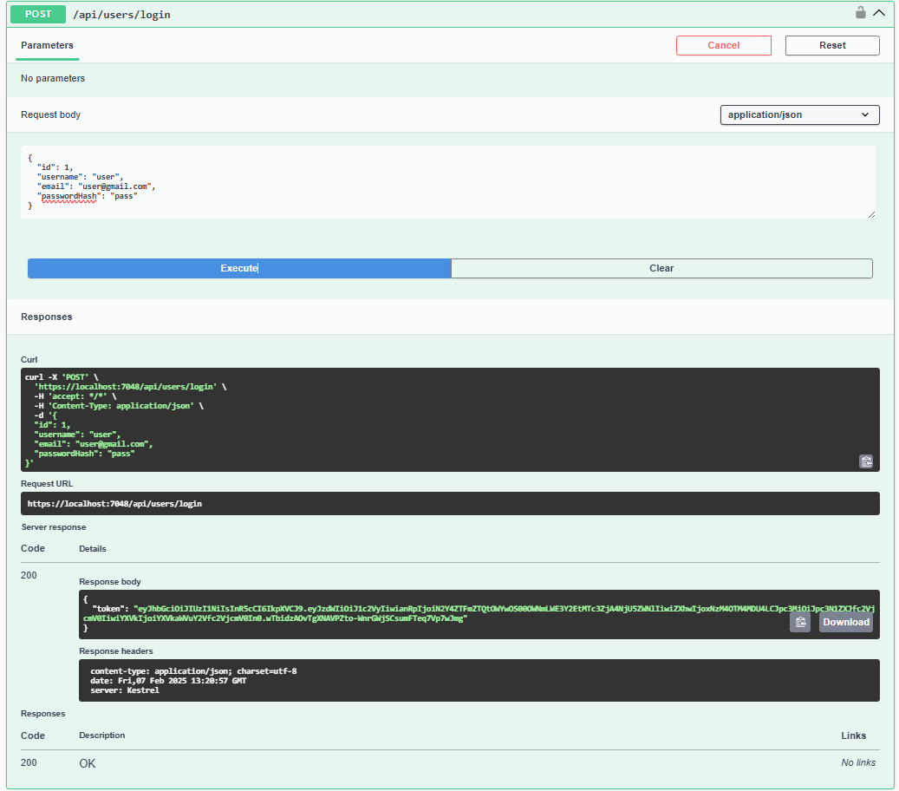
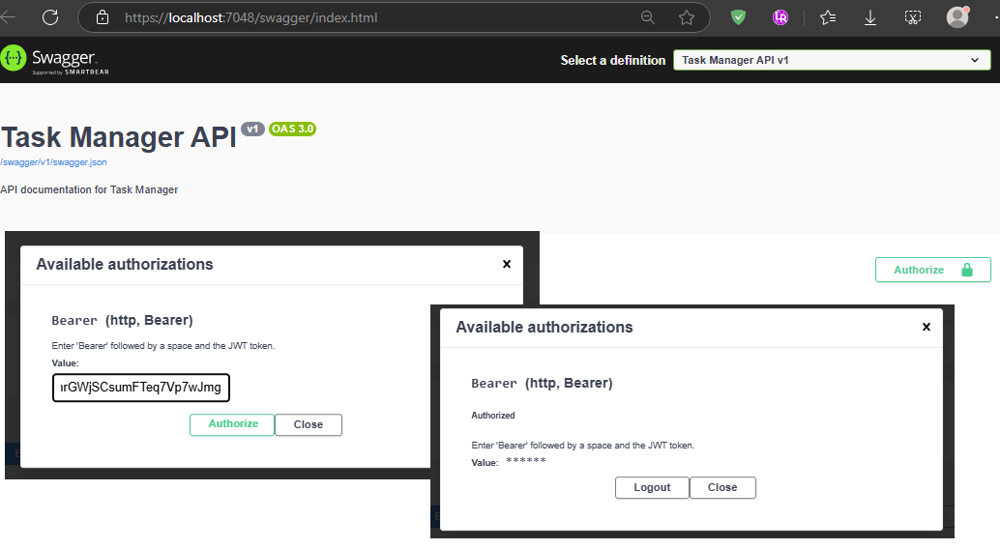
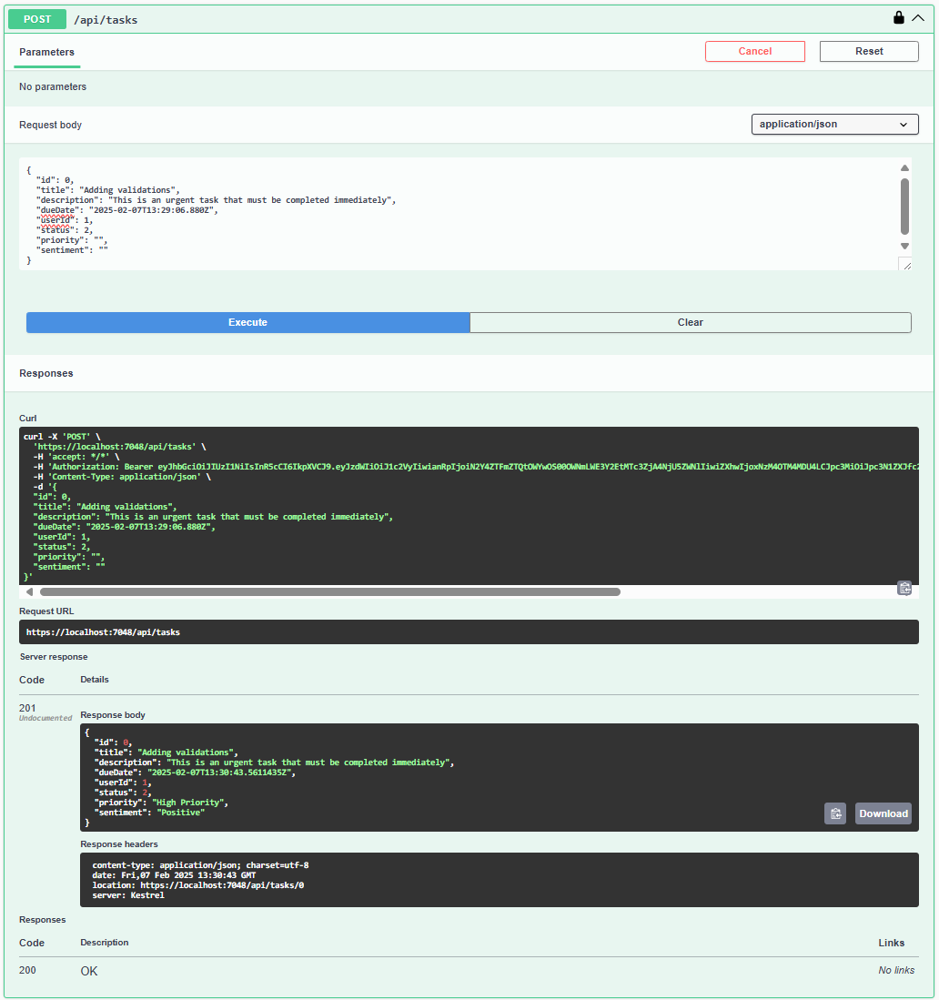
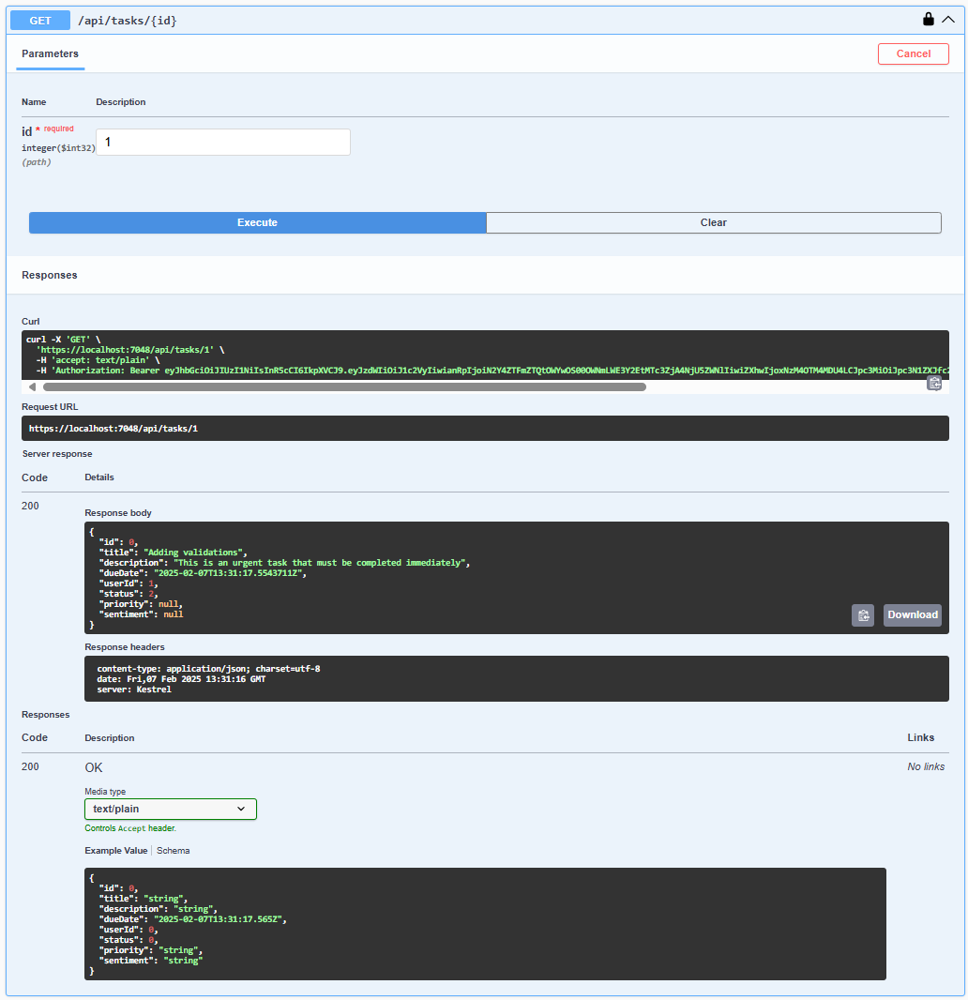
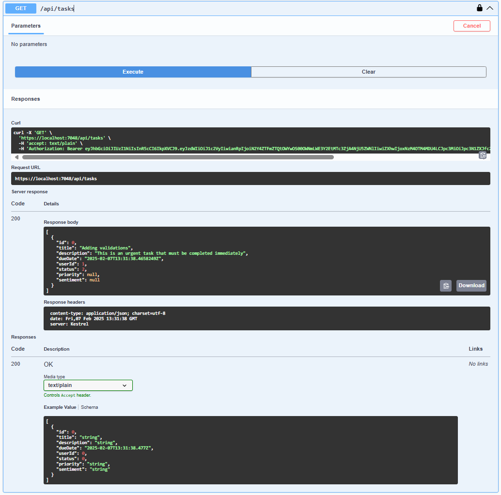
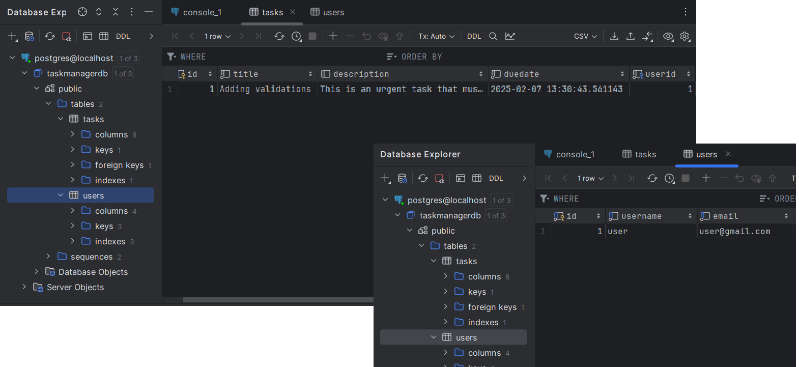


### User Story: Manager of Tasks

#### **Title:** Task Management System

#### **Description:**
A task management system that allows users to create, update, delete, and view tasks. Users must register and log in to manage their tasks. The system will prioritize tasks based on due dates and allow AI-based insights to help users organize their work efficiently.

#### **Features:**
1. **User Authentication**
   - Users can register, log in, and manage their profiles.
   - JWT-based authentication for API security.

2. **Task Management (CRUD Operations)**
   - Users can create tasks with a title, description, and due date.
   - Users can update and delete their own tasks.
   - Users can view a list of tasks with filters and sorting options.

3. **AI-Powered Insights**
   - AI suggests task prioritization based on urgency and workload.
   - AI provides sentiment analysis on task descriptions to categorize tasks.

#### **Acceptance Criteria:**
- Users must authenticate to create or manage tasks.
- Tasks must have a title, description, and due date.
- Tasks must be persistently stored in the database.
- AI insights should provide task prioritization and categorization.

---

### Project Structure
```
├── TaskManager.sln  # .NET Solution file
├── src
│   ├── TaskManager.API  # Presentation Layer (Web API)
│   │   ├── Controllers
│   │   ├── Program.cs
│   │   ├── Startup.cs
│   ├── TaskManager.Application  # Application Layer (Use Cases, Interfaces)
│   │   ├── Interfaces
│   │   │   ├── ITaskRepository.cs
│   │   │   ├── IUserRepository.cs
│   │   ├── Services
│   │   │   ├── TaskService.cs
│   │   │   ├── UserService.cs
│   ├── TaskManager.Domain  # Domain Layer (Entities, Business Rules)
│   │   ├── Entities
│   │   │   ├── Task.cs
│   │   │   ├── User.cs
│   │   ├── Enums
│   │   ├── ValueObjects
│   ├── TaskManager.Infrastructure  # Infrastructure Layer (Database, Repositories)
│   │   ├── Persistence
│   │   │   ├── DatabaseInitializer.cs
│   │   ├── Repositories
│   │   │   ├── TaskRepository.cs
│   │   │   ├── UserRepository.cs
│   │   ├── DatabaseConnection.cs
│   ├── TaskManager.Tests  # Test Project (Unit Tests)
│   │   ├── Application
│   │   ├── Domain
│   │   ├── API
│   │   ├── Infrastructure
│   ├── docker-compose.yml  # Docker configuration
│   ├── README.md  # Documentation
```

---

### **Project Configuration**
In the file `appsettings.json`, you can configure the database connection string and JWT authentication settings.
```json
{
  "ConnectionStrings": {
	"DefaultConnection": "Host=localhost;Port=5432;Database=taskmanagerdb;Username=postgres;Password=admin"
  },
  "JwtSettings": {
	"SecretKey": "my_secret_key",
	"Issuer": "my_issuer",
	"Audience": "my_audience",
	"AccessTokenExpiration": "1"
  }
}
```
There is a `docker-compose.yml` file in the root directory that defines the services required for the application. 

The configuration includes:

- **API Service**: Web API project running on port 5266.
- **Database Service**: PostgreSQL database running on port 5432.
- **API Service Dependencies**: Database service.
- **Database Initialization**: Automatic database creation and seeding.
- **Environment Variables**: Database connection string.
- **Docker Network**: Services connected to the same network.
- **Volumes**: Database data persistence.

---

### **Database configuration**
- Run the database container:
  ```sh
  docker run --name taskmanager-postgres -e POSTGRES_USER=admin -e POSTGRES_PASSWORD=password -e POSTGRES_DB=taskmanagerdb -p 5432:5432 -d postgres
  ```
  
- Run the database:
  ```sh
  docker-compose up -d
  ```
- IMPORTANT: After the container is built, create the database:
  ```sh
  CREATE DATABASE taskmanagerdb;
  ```
- To confirm the container is running, execute:
  ```sh
  docker ps
  ```

- If you no longer need the database, execute:
  ```sh
  docker stop taskmanager-postgres
  docker rm taskmanager-postgres
  ```
  
---

### **Run the project**

- To start the project, execute:
  ```sh
  dotnet build
  dotnet run --project src/TaskManager.API
  ```

- To see documentation of the API, open the following URL in your browser:
  ```
  http://localhost:5266/swagger/index.html
  https://localhost:7048/swagger/index.html



---

### **Testing API Methods**

- In the Swagger UI, you can test the API endpoints, such as:
  - Register a new user.
  - Log in to get an access token. Set the token in the "Authorize" button.
  - Create a new task.
  - Get a list of tasks.
  - Update a task.
  - Delete a task.

- Next images display each API endpoint Swagger UI test:
  - Register a new user.

  - Log in to get an access token. 

  - Set the token in the "Authorize" button.

  - Create a new task.

  - Get one task.

  - Get a list of tasks.

  - Update a task.
  - Delete a task.
  - Inside the TaskItem Table in DB.

---

### **AI - case study **

- AI-Based Task Prioritization
Checks keywords in the task description (urgent, immediately, later, optional).
Returns "High Priority", "Medium Priority", or "Low Priority".

- AI-Based Sentiment Analysis
Uses ML.NET to train a basic sentiment model.
Classifies task descriptions as Positive or Negative.

- Initial rules:

  ```C#
        new SentimentData { Text = "urgent", Sentiment = true },
        new SentimentData { Text = "important", Sentiment = true },
        new SentimentData { Text = "delayed", Sentiment = false },
        new SentimentData { Text = "later", Sentiment = false }
  ```

  
---

### ** AUTHOR: **
- **Name:**	 [Andrés Rosero T.]
- **Email:** [andres.rosero@outlook.com]
- **LinkedIn:** [https://www.linkedin.com/in/andres-roserot/]
- **GitHub:** [xxx]
- **Location:** [xxx]
